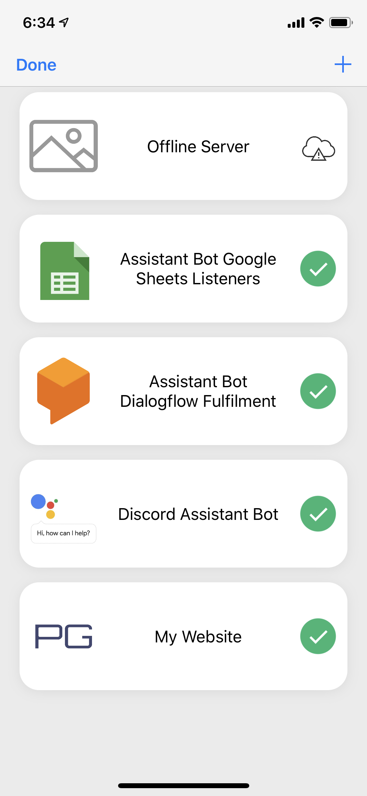

# Dashboard iOS
> Monitors the status of my web apps

	

## Features
### Service Status
- Pings services to check status
- Future roadmap: receive a push notification when a service goes down

### Dynamic Favicon lookup
- Favicon is automatically fetched from the web app URL
- Want a better icon? Choose a custom image in the image picker