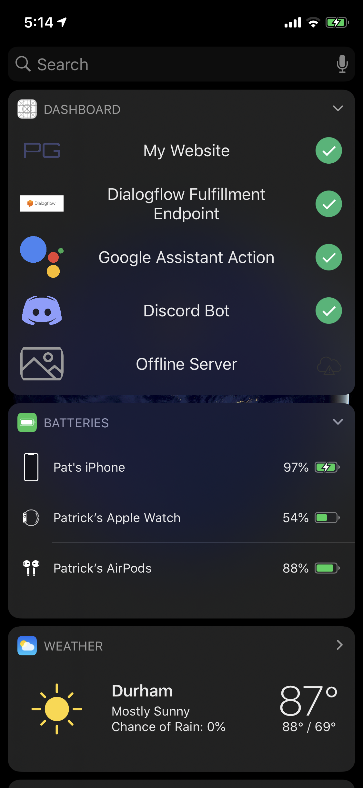
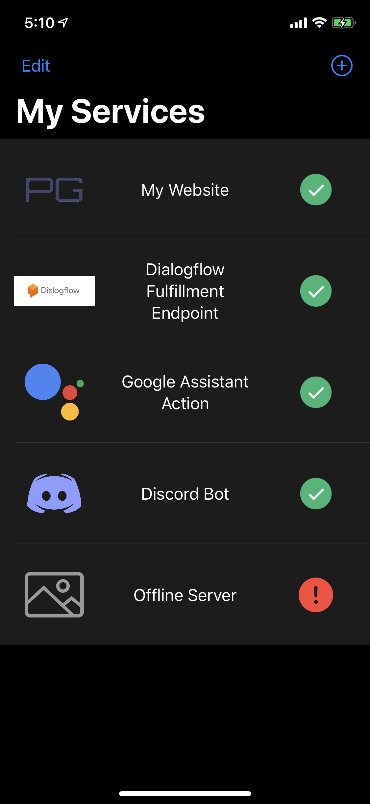
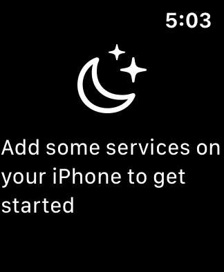
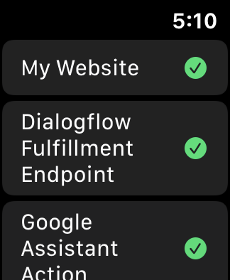

# Dashboard iOS
> Monitors the status of my web apps

### News
Big moves are happening in the [SwiftUI](https://github.com/pg8wood/dashboard/tree/feature/swiftui) branch! Other developement is paused while I'm exploring SwiftUI.
 

	
	
	 
	
	

## Features
### Service Status Viewer
- Pings services to check status
- Future roadmap: receive a push notification when a service goes down

### Today Widget
- Check in on your services at a glance from your lock screen

### Dynamic Favicon lookup
- Favicon is automatically fetched from the web app URL
- Want a better icon? Choose a custom image in the image picker
